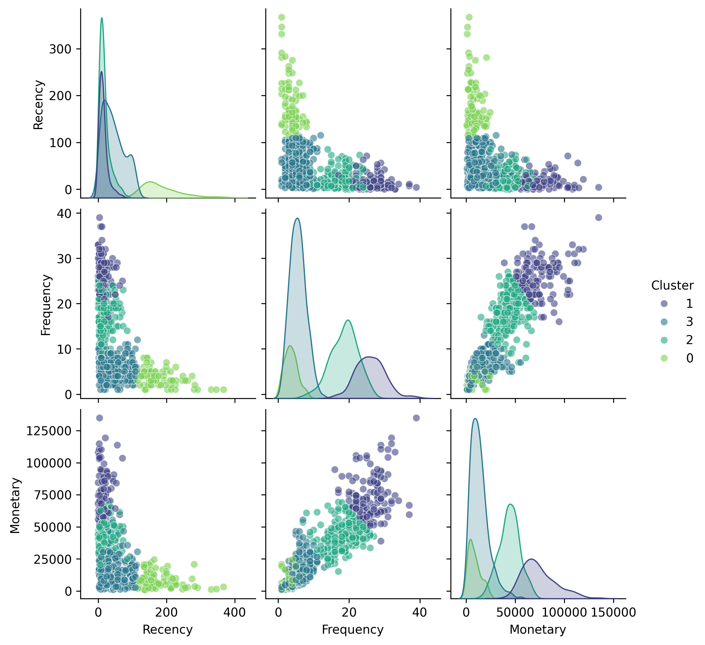

# 🚀 Data-Driven E-Commerce RFM Segmentation & Predictive Clustering Pipeline

[](https://github.com)
[](https://python.org)
[](https://microsoft.com)

> 💡 **Business Core:** How do we transform millions of raw transactional data rows into precision marketing strategies? This project builds a hybrid analytics pipeline using **Power BI** for ETL data preparation and **Python (Scikit-Learn)** for automated customer segmentation via Unsupervised Machine Learning.

---

## 📊 Project Showcase

### 🔍 Interactive Dashboard & Distribution Analysis
Here is the visual representation of our customer segments based on their purchase behaviors. The multi-dimensional analysis isolates low-value risk groups from high-contributing champions.



---

## 🎯 Key Business Highlights

- **Dynamic ETL Data Cleansing (Power BI)**: Processed raw transaction logs (`SalesRecordV05`), implemented conditional mapping to factor in sales volume (`Unitsold`), price parameters, and custom discount deductions (`Discount`).
- **Statistical Percentile Scoring**: Engineered robust Recency, Frequency, and Monetary scores using Pandas quantiles to avoid duplicate boundary errors (`rank(method='first')`).
- **Unsupervised Machine Learning**: Applied **Min-Max Feature Scaling** followed by **K-Means Clustering (K=4)** to separate data points into high-cohesion buyer persona networks.
- **Actionable Customer Classification**: Automatically categorized all active buyers into explicit operational segments: `High`, `Medium`, `Low`, and `Missing`.

---

## 🛠️ Tech Stack & Architecture

[Raw Transactional Data]
│
▼ (Power BI / Power Query)
[Data Cleaning & Margin Calculations]
│
▼ (Export to Pandas Dataframe)
[Feature Scaling: MinMaxScaler]
│
▼ (Algorithm: K-Means Clustering)
[Strategic Group Classification & Pairplot Visuals]

- **Data Prep & ETL:** Microsoft Power BI (Power Query / Table Joins)
- **Programming & Math:** Python 3, NumPy, Pandas
- **Machine Learning:** Scikit-Learn (`MinMaxScaler`, `KMeans`)
- **Visualization:** Seaborn, Matplotlib

---

## 📦 How to Run This Pipeline

### 1. Prerequisites
Clone the repository and install the data science dependencies:
```bash
git clone https://github.com/hanyuchen0404-sherry/RFM-Analysis.git
cd RFM-Analysis
pip install pandas numpy scikit-learn seaborn matplotlib


### 2. Execution
Open the Jupyter Notebook RFM_Analysis.ipynb or run the sequence to process RFM_Data.csv:
# The pipeline automatically parses dates, normalizes vectors, and exports results
# Output generated: 'RFM_Pairplot.png' and 'RFM_result.csv'


💡 Strategic Marketing Insights (ROI Driven)
Based on the final K-Means clustering algorithm output (RFM_result.csv), here is the automated enterprise campaign dispatch recommendation:
Customer Group	Behavioral Pattern	Recommended Marketing Action
⭐ High
	Recently purchased, buys frequently, huge spend.	VIP loyalty rewards, exclusive early-access previews, referral incentives.
📈 Medium
	Moderately active, steady behavior.	Cross-selling products, limited-time bundle coupons to bump ticket size.
⚠️ Low
	Active but lower purchase frequency or lower spending.	Personalized product recommendations, standard engagement coupons.
💤 Missing
	Long inactive days, low frequency, dormant behavior.	Low-cost automated re-engagement email flows, win-back discounts.


✉️ Contact & Collaboration
Developed with ❤️ by Sherry (hanyuchen0404).
If you find this repository helpful for your data science portfolio or business operations, please drop a ⭐! For business analytics or data engineering inquiries, feel free to reach out via GitHub Issues.
